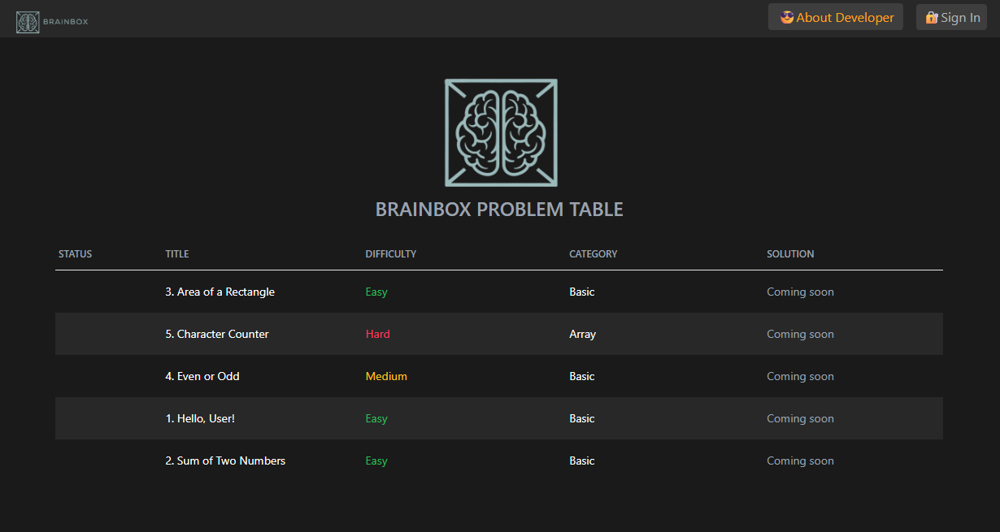
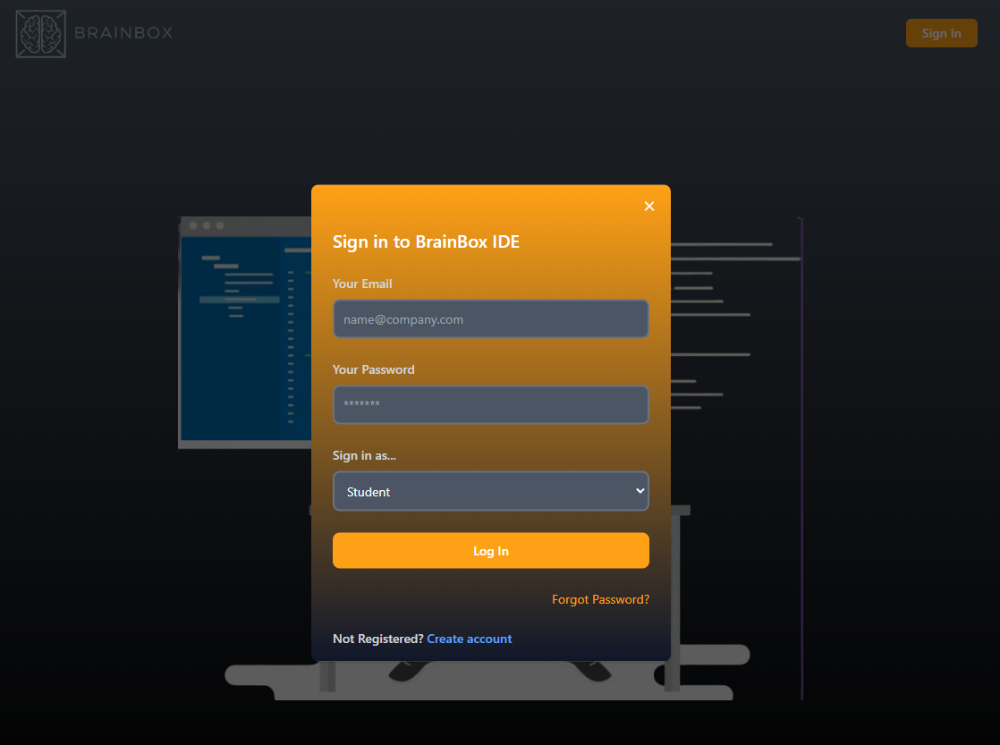
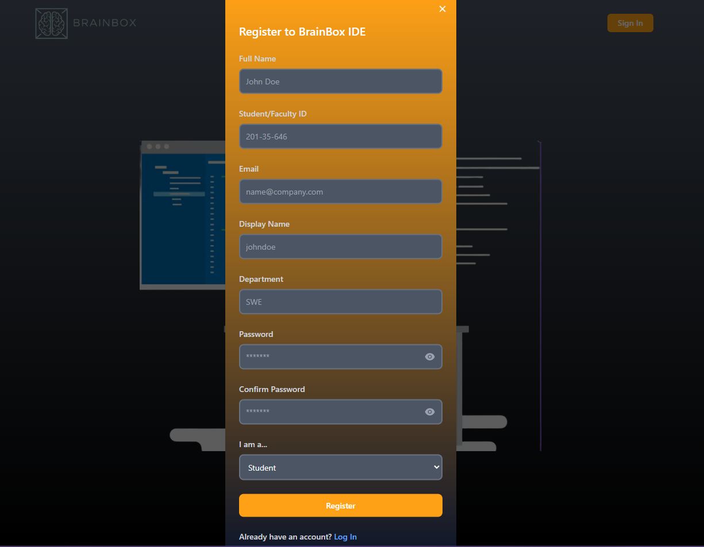
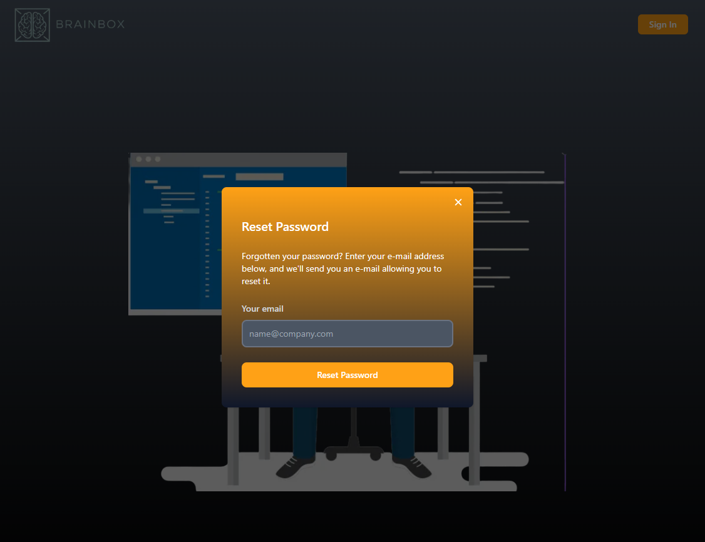
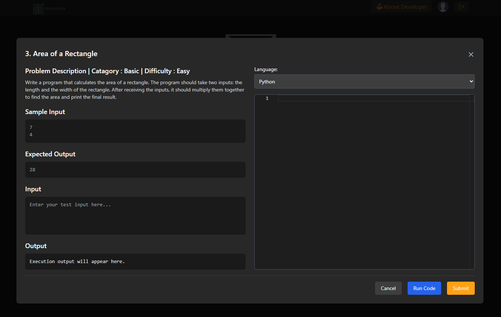
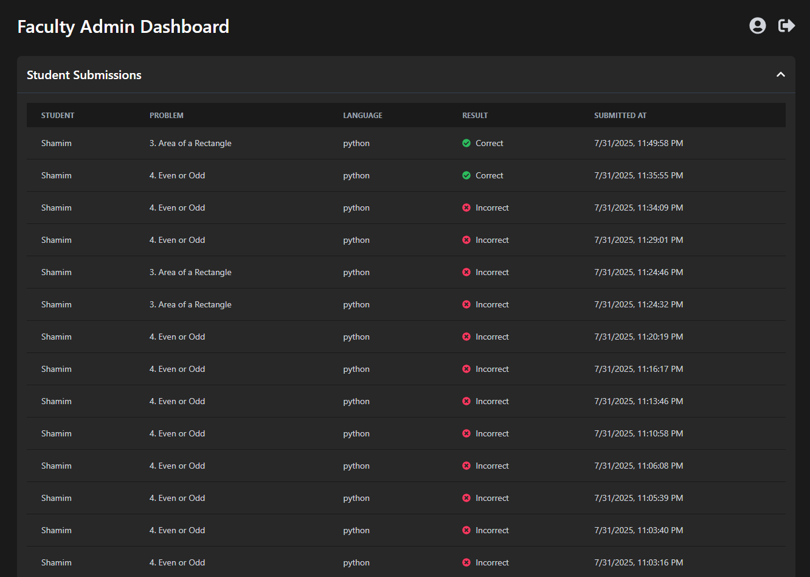
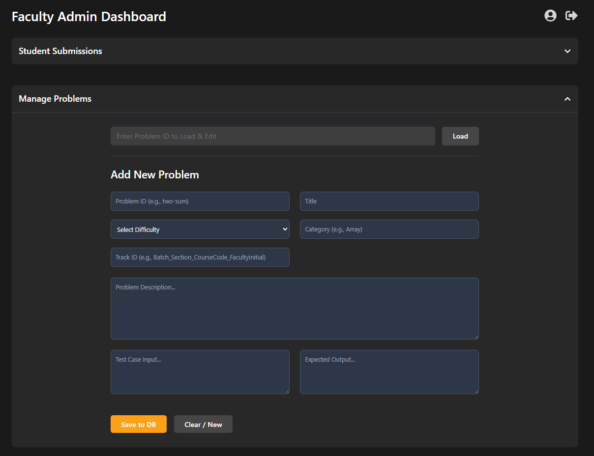
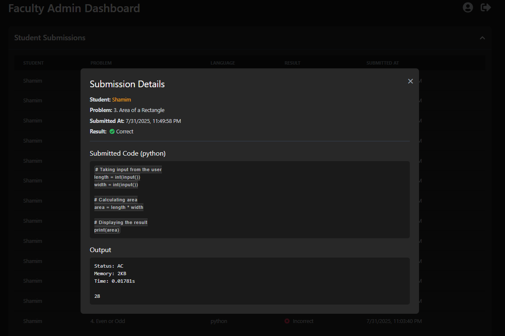
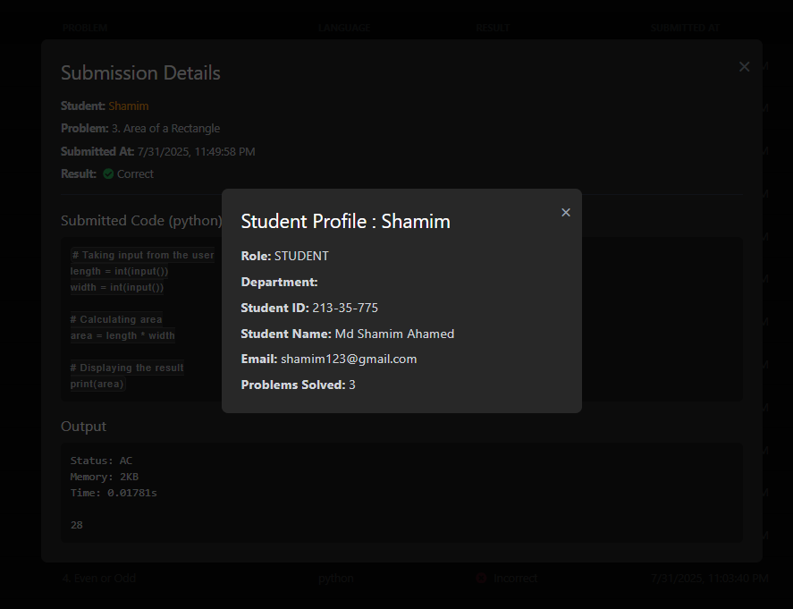
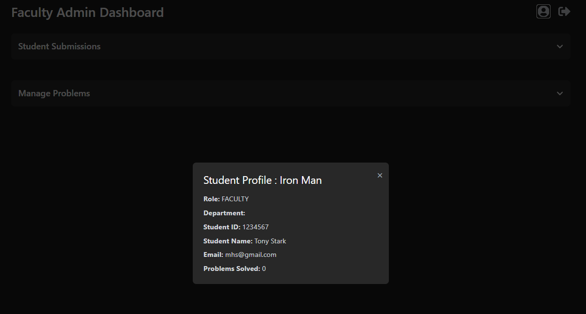

# 🧠 BrainBox IDE - Final Defence Project

BrainBox IDE is an interactive coding platform designed for educational institutions. It supports real-time code evaluation, student submissions, and a robust faculty dashboard. The system streamlines the learning process with a clean interface and powerful backend tools.

---

## 🚀 Features

- 🔐 Secure Sign In / Sign Up / Password Reset
- 🧑‍🎓 Student dashboard with problem-solving area
- 👩‍🏫 Faculty dashboard for managing problems and reviewing submissions
- 📊 Detailed submission history and analysis
- 🧾 User profile for both students and faculty
- 🎯 Real-time validation and code execution

---

## 📸 Screenshots

### 🔷 Main Dashboard


### 🔐 Sign In Screen


### 📝 Sign Up Screen


### 🔁 Forgot Password Screen


### 👨‍💻 Problem Solving Screen


### 🧾 View Student Submissions (Faculty Dashboard)


### 🛠 Manage Problems (Faculty Dashboard)


### 📑 Submission Details (Faculty Dashboard)


### 👤 Student Profile View


### 👩‍🏫 Faculty Profile View


---

## 🛠 Tech Stack

- **Frontend**: React, Next.js, TailwindCSS  
- **State Management**: Recoil  
- **Backend**: Firebase (Auth, Firestore, Cloud Functions)  
- **Code Execution**: Secure API-based sandbox  
- **Notifications**: React Toastify  
- **Form Validation**: React Hook Form

---

## 📁 Folder Structure

/components -> Reusable React components
/pages -> Route-based pages (e.g., /signin, /dashboard)
/context -> Recoil global state
/utils -> Helper functions and TypeScript types
/styles -> Tailwind & global styles
/public -> Static assets like images


---

## ♿ Accessibility Highlights

- All form elements have `labels`, `placeholders`, or `aria-labels`
- Fully keyboard-navigable interface
- axe-core and Lighthouse tested
- Error messages and screen reader support for inputs

---

## 📌 Future Improvements

- ✨ Dark mode toggle
- 💬 Discussion thread per problem
- 🧠 AI-powered code hints
- 📈 Performance analytics dashboard
- 🌐 Language localization

---

## 📚 How to Run Locally

```bash
# 1. Clone the repository
git clone https://github.com/your-username/brainbox-ide.git
cd brainbox-ide

# 2. Install dependencies
npm install

# 3. Set up Firebase credentials in `.env.local`

# 4. Start the development server
npm run dev

👨‍💻 Developed By
BrainBox Dev Team - Md Shamim Ahamed
Final Year Project — Department of Software Engineering
University Project 2025

